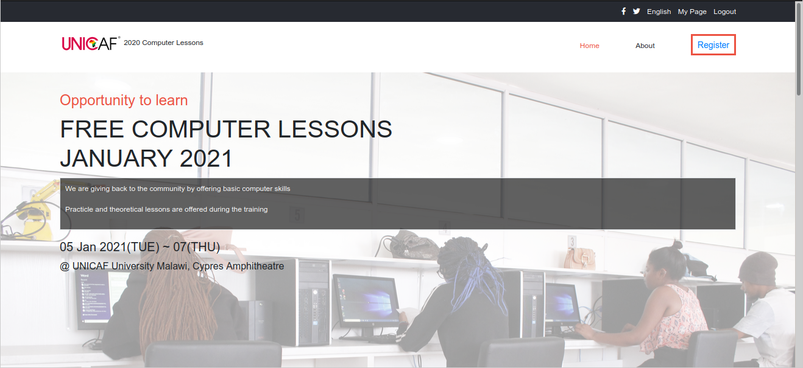

# Capstone Project - Free Computer Lessons
>This capstone project is designed to demonstrate understanding of html and css. I have used free computer lessons to demonstrate my creativity when working on various projects. 

## Project Requirements

### General
- You can find the original project specification at [Notion.so](https://www.notion.so/HTML-CSS-capstone-project-Conference-page-ed3efca4b9824484a9df7f9f24067ff7).

### Specific to Microverse
- Should build atleast 3 pages
- Each of these pages should have versions for 2 different screen sizes 
- Use a mobile first approach when dealing with mediaqueries with 2 breakpoints (you should figure out the exact width for each breakpoint by yourself).

## Built With

- HTML
- CSS
- Bootstrap

## Live Demo

[Live Demo Link](https://lichapa.github.io/FreeComputerLessons/)

## Authors

## Mphatso Lichapa
- Github:[@Lichapa](https://github.com/Lichapa/)
- Twitter:[@LichapaMphatso](https://twitter.com/LichapaMphatso)
- LinkedIn:[@Mphatso Lichapa](https://www.linkedin.com/in/mphatsolichapa)

## Show your support

Give a ⭐️ if you like this project!
